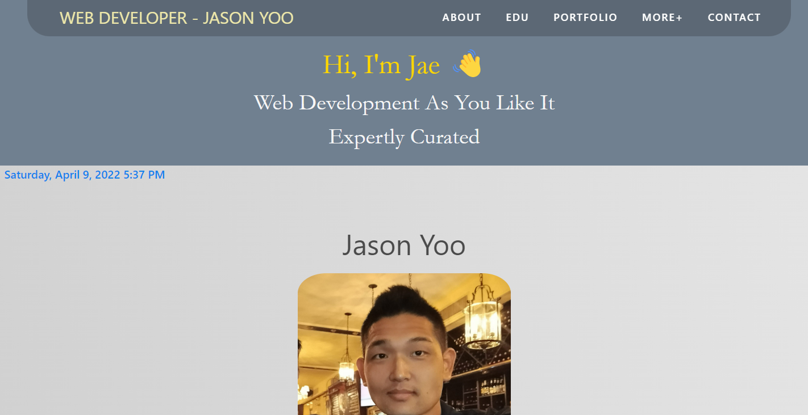
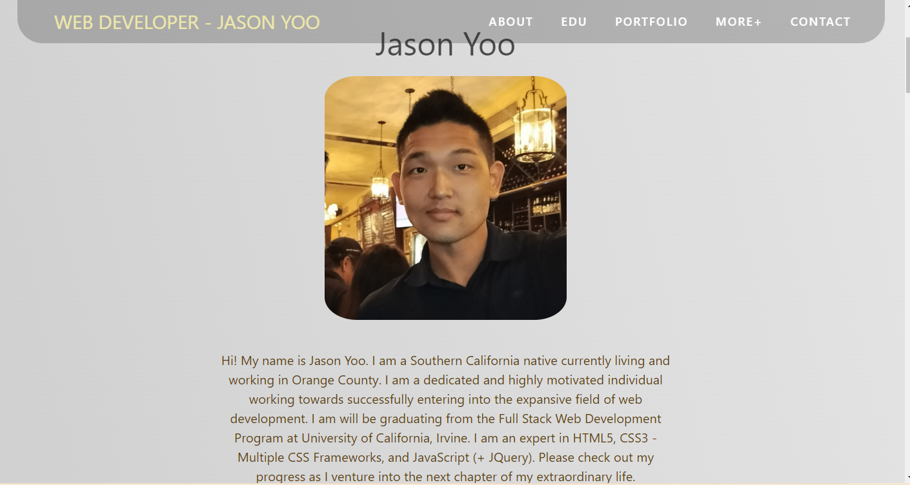
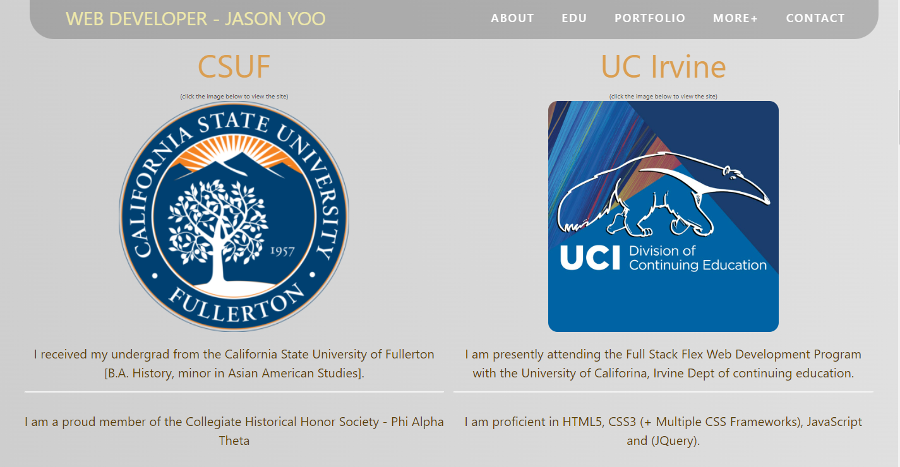
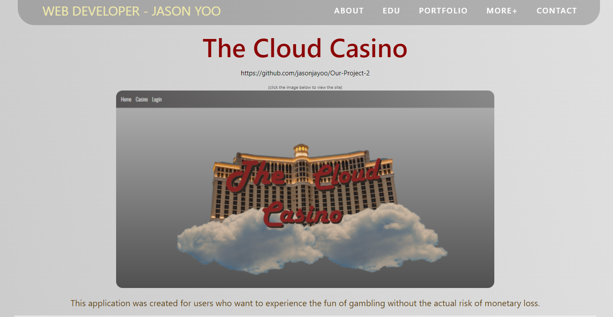
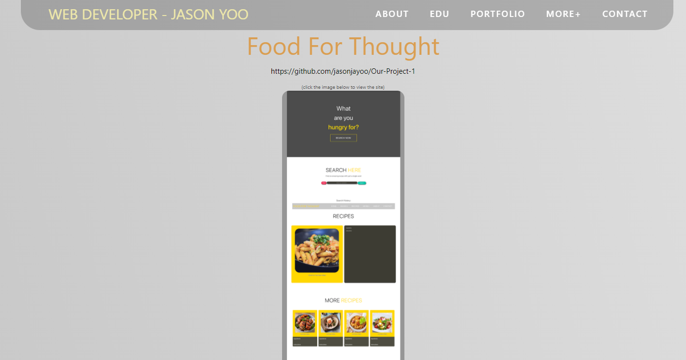
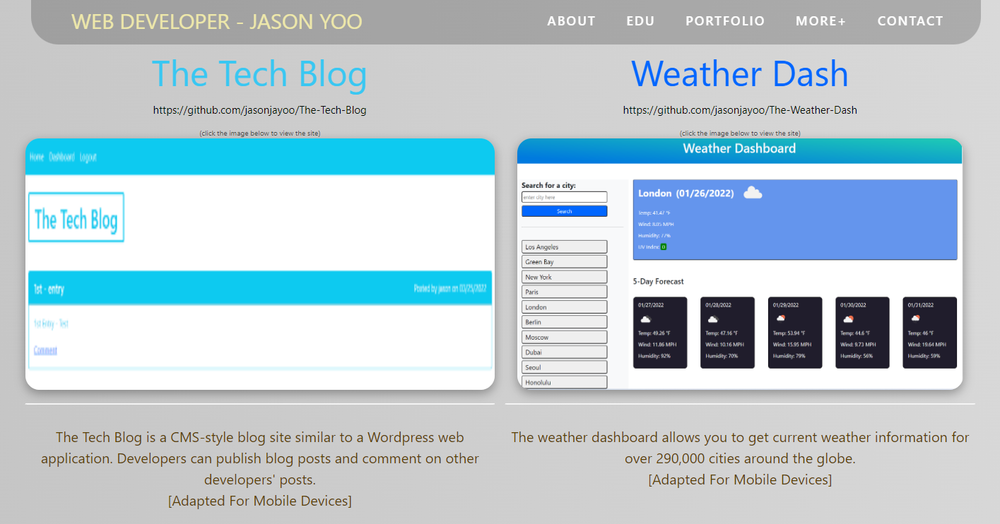
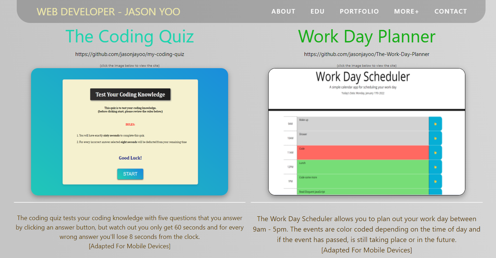
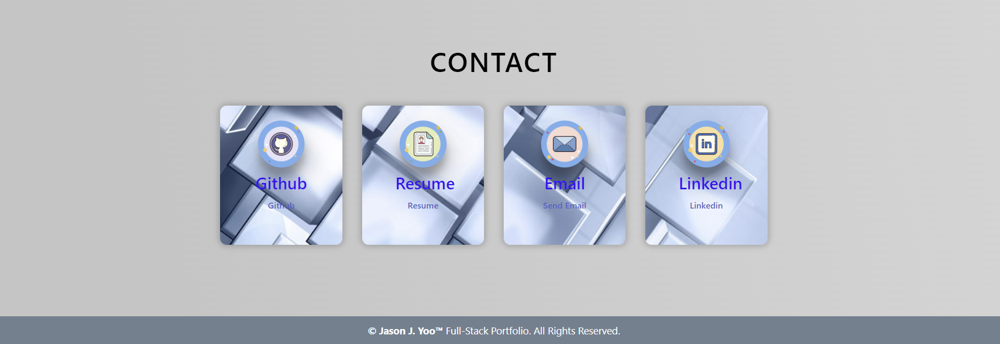
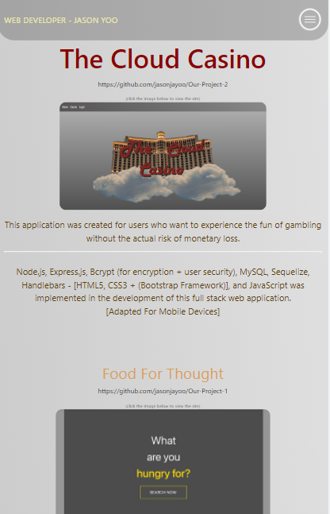
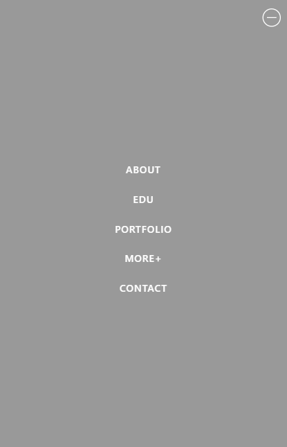

# 16 Project 2: Professional Materials

(Homework-16: Updated Full-Stack Portfolio)

 

## Project Description: 

Even numbered week homework assignment. Update Portfolio to include Second Project and a least three exemplary homework assignments.

  

## Table of Contents:

 

- [Installation](#installation)
- [Usage](#usage)
- [Credits](#credits)
- [License](#license)
- [Badges](#badges)
- [Features](#features)
- [How](#howtocontribute)
- [Criteria](#criteria)
- [HTML](#html)
- [CSS](#css)
- [Github](#github)
- [URL](#url)

 

## Installation
 
** Go to <a href="https://jasonjayoo.github.io/Full-Stack-Portfolio/" target="_blank">Full-Stack-Portfolio</a> In order to view My Full-Stack Portfolio Webpage.

 
 

## Usage: screenshots - (Highlighted Title(s) = a hyperlink to the direct image)

 
 

[Screenshot1](images/Screenshot1.png)  "Top of the portfolio page + Current date & time"

 

[Screenshot2](images/Screenshot2.png)  "About me section"

 

[Screenshot3](images/Screenshot3.png)  "My Education History Section"

 

[Screenshot4](images/Screenshot4.png)  "Second Project Section"

 

[Screenshot5](images/Screenshot5.png)  "First Project Section"

 

[Screenshot6](images/Screenshot6.png)  "First two additional projects - The Tech Blog & Weather Dash"

 

[Screenshot7](images/Screenshot7.png)  "Second two additional projects - The Coding Quiz & Work Day Planner"

 

[Screenshot8](images/Screenshot8.png)  "My Contact & Resume Section"

 

[Screenshot9](images/Screenshot9.png)  "Hamburger Nav Bar"

 

[Screenshot10](images/Screenshot10.png)  "Hamburger Nav Bar Expanded"

 
 

## Credits:

- I would like to thank my exceptional instruction staff and my tutor Faran Navazi for their continous help in my growth as a web developer.

 

- Also would like to thank my project two team mate Mr. Nicholas V. For his great dedication and effort in working with me to bring The Cloud Casino Full Stack Application to fruition. 

 

## License:
 
    -  MIT License - Copyright (c) 2022 Jason Yoo
 
 

## Badges:
 
    - UCI Full Stack Bootcamp
 
 

## Features:
 
    - Floating nav bar with links to the local sections of the webpage.
    - Picture of me and some information about myself
    - Information of my educational background
    - Images/links of my five main projects, the images opens new tabs to their respective websites.
    - Contact section with links to my resume, email, and linkedin profile with links once clicked will open new tab. 

 
 

## How to Contribute:
 
    - My github repository is publically viewable. If you would to contribute to the webpage please email me at my link on the webpage with you github username and I will add you as a contributor on the repo. 
 
 

## Tests:
 
    - You can test out the webpage on vsc or directly in the inspect window of your browser. 
 
 

## Criteria's met: 

 

1. Updated portfolio by featuring Project 2 & Project 1 and additional exemplary hw assignments (added 4 more)
2. Updated Github profile with pinned repositories featuring Project 2 and four exemplary assignments
3. Updated Resume
4. Updated Linkedin
5. Displayed my contact information
6. Each portfolio image acts as a link to the deployed web page.
7. Updated Github with link in contact section

 
 

## HTML - Details:

 

1. Utilized Bulma CSS Framework, Font Awesome, A splash of jquery, and moment js. 
2. Created sections for header + nav bar, hero, about, edu, works, more works, and contact.
3. Added h2's images and p tags to each segment and fill it with pertinent information.
4. Added href links to all live websites and contact information.
5. Set up columns and rows using Bulma.

 

## CSS - Details:

 

1. Created customer floating nav bar. 
2. Set unique background color/image for body of the page to a linear gradient of two different grays.
3. Font set to monospace and BlinkMacSystemFont,-apple-system,"Segoe UI",Roboto,Oxygen,Ubuntu,Cantarell,"Fira Sans","Droid Sans","Helvetica Neue",Helvetica,Arial,sans-serif.
4. customized specs for each h2, imgs and paragraphs.
5. Implemented @keyframes animation specs for hero text with specified time delayed reveals.
6. Set specs for date and time stylization.
7. Set custom specs for the hero section.
8. Set custom specs for nav bar/header section.
9. Created hamburger nav for mobile and tablet screens.
10. Added customer features to the contact info section. 
11. Created specific media queries to stream line display aspects depending on different screen sizes. 

 

## JS - Details:

1. Created event listener for hamburger nav bar and regular nav bar clicks to handle users clicks to view specific sections of the portfolio.

2. Implemented moment.js to render time on the DOM 
 
 

## Github (Github Repository):

Click [here](https://github.com/jasonjayoo/Full-Stack-Portfolio) to go to my Full-Stack-Portfolio Github Repository

 

## URL (Published Webpage):

<a href="https://jasonjayoo.github.io/Full-Stack-Portfolio/" target="_blank">Full-Stack-Portfolio</a>

